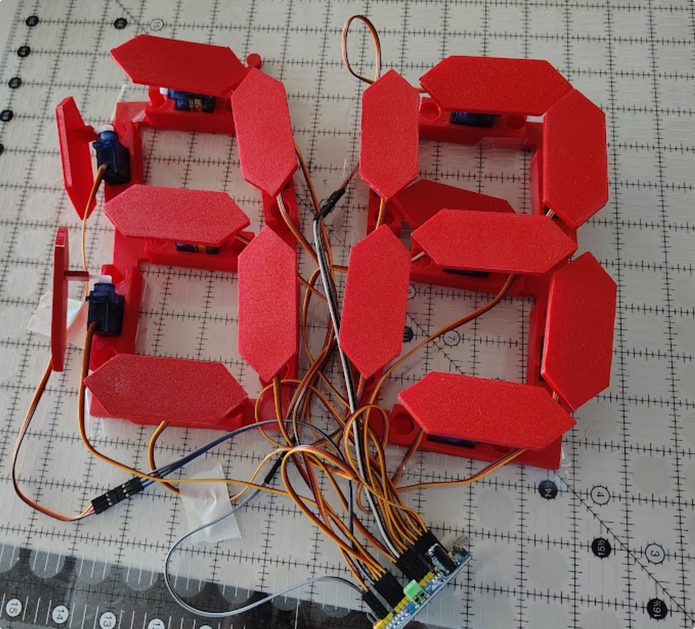

## Overview

<!-- Insert information about the goals of the project and what the project is. -->
Create a several segment clock to learn communication protocols, print statement debugging, and wire management in a physical project.

## Visuals

<!-- Insert Pictures of the project -->
These pictures are from the development stage of the project.
{width=400px}
{width=400px}
{width=400px}

## Contribution

<!-- Talk about what parts I did for the project -->
I briefly saw an image of a similar project and wanted to attempt to create everything from scratch. This has thus far been limited by my lack of understanding of communication protocols and rather than risk breaking electrical parts, I enrolled in classes that would teach those communication protocols. Otherwise I have designed the initial layout of the physical components and the code base to match.

## Technical Details

<!-- Insert any technical information that would be desired -->
The parts for the template are as follows:

* Clock segment or a servo mount
  * 
* Clock Face
  * 
* Corner link
  * 
* Center links
  * 

As for files to print these parts and the final parts look no further than this [zip folder](ClockProject.zip)

| Item Name | Quantity | Price |
| :------------------ | :------------- | :------ |
| [Arduino Uno](https://www.amazon.com/s?k=arduino+uno&crid=3HS7LSJUDIEZV&sprefix=arduino+un%2Caps%2C242&ref=nb_sb_noss_2) | 1 | $27.60 |
| [SG90 Micro Servo Motor](https://www.amazon.com/10Pcs-Servos-Helicopter-Airplane-Controls/dp/B07MLR1498/ref=sr_1_2_sspa?crid=2P7G8ZSMZV0LR&dib=eyJ2IjoiMSJ9.DO_8huDXG-WCdEl_xxmMGHDTUq8Gy0sMBJu8P0uFAgVhzhgI-8Auign9UCI5rCaoxSxoYndJU5MYyev8C0a6ieWYdkzcgTzYfCfg0Cgzw-5ms2qD_ftnp_WAp6iGd6PH9KNRJEF3-4Nl5oe_stC43c_bBayX0liXO2K9QQAUbg2Dmh9al7SuJ6ZSTZh8fxflVRFM6yjkgBWzHdpXVPr-LDv9YqT8s8fDWtMQqxyiWLtozejDWtPCj6HElPdYyuiXUbApW2n6FGIv7D1uqR5DuTkAs2chwLgGHoaiO4OaNSA.u9U_zUnuJQdYyKSZm65shdvbQavOO6G2fdaWJDlAY2I&dib_tag=se&keywords=SG90%2BMicro%2BServo&qid=1767662914&s=toys-and-games&sprefix=sg90%2Bmicro%2Bservo%2Ctoys-and-games%2C180&sr=1-2-spons&sp_csd=d2lkZ2V0TmFtZT1zcF9hdGY&th=1) | 22 | $41.20 |
| [PCA9685 16 Channel PWM Servo Motor Driver Board](https://www.amazon.com/dp/B0DFTLMJCX?ref_=ppx_hzsearch_conn_dt_b_fed_asin_title_2) | 2 | $9.99 |
| 3D filament | Unknown | Unknown |

### Code Base Examples

Diagram for joint to servo number:

```Arduino

/*

 DIAGRAM
   -         20             13          6
-    22   18    19       11    12     4   5
   -          17            10          3
-    21    15    16       8     9     1   2
   -          14             7          0
hourTen   hourOne        minuteTen   minuteOne


*/
```

Section regarding minute tracking and likely where the clock drift bug takes place.

```Arduino

  currMilli = millis();
  duration = currMilli-prevMilli; // systematically identify how long things have been running for TESTING
  Serial.println(duration);
  if (duration > minuteTime){ 
  
    // Ok research says that since they are unsigned longs this one line should TECHNICALLY handle the overflow
Serial.println("We made it into the loop and you didn't mess up the math");
  
    changeTime();
    
    }

    char customKey = customKeypad.getKey();

  if (customKey!= NO_KEY){

    inputKeypad();

  }

  delay(100);
```

Setting the clock to a desired time relies on one outward facing method which calls other specified methods:

```Arduino

void setClock(int num){ // When in combination with switch to set time.

  //first lower all planes before we start worrying about the 3-4 digit number getting passed
  closeSevenSegmentDigit(0);
  closeSevenSegmentDigit(7);
  closeSevenSegmentDigit(14);
  closeTwoSegmentDigit(21);

Serial.println("closed segments");

  int digit = num % 10; //isolate last digit- forced to be 0-9
  num = num / 10; // prepare num for next section
  setMinuteOne(digit); // send last digit to lowest place - repeat
  digit = num % 10;
  num = num / 10;
  setMinuteTen(digit);
  digit = num % 10;
  num = num / 10;
  setHourOne(digit);
  setHourTen(num); // num should only be 1 place left and that should be a 1 or a 0. 
  prevMilli = currMilli;

}
```

Here's a sample of the setMinuteTen cases for how it'll handle each number at that digit.

```Arduino

void setMinuteTen(int desired){// raises the individual planes one by one to represent each number for the tens place in the minute location

    switch(desired){

    case 0:

      moveNumUp(7);
      moveNumUp(8);
      moveNumUp(9);
      moveNumUp(11);
      moveNumUp(12);
      moveNumUp(13);
      break;
    
    case 1:

      moveNumUp(9);
      moveNumUp(12);
      break;

  }
  
  minuteTen = desired; 

}
```

Here's one of the helper functions that moves the individual segments.

```Arduino

// Num means its connected to the servo controller
// Pin means its directly connected to the servo controller. 
void moveNumUp(int servoNum){

  if (servoNum > SERVO_DRIVER_CAP){

    for (int pos = SERVO_MIN; pos<=SERVO_MID; pos++){

        driver.setPWM(servoNum, 0, pos);
        delay(5);

    }

    delay(10);
    driver.setPWM(servoNum,0, SERVO_MID);

  } else {

    for (int pos = SERVO_MIN; pos<=SERVO_MID; pos++){

      driverTwo.setPWM(servoNum, 0, pos);
      delay(5);

    }

    delay(10);
    driverTwo.setPWM(servoNum,0, SERVO_MID);

  }

}
```

The rest of the code is available in [this arduino file.](HexClockV1.ino)

### Points of Concern

1. The clock drifts after a period of operation. This is caused by the length of time it takes to move each digit and can be calculated for or solved by using a clock module instead of running it through the update section.
2. The 5V line from the Arduino module and an extra amp are not enough to move each digit when all the motors are attached. A secondary power supply would be needed in order to ensure movement works long term.

## Results

<!-- Did we meet project reqs, did we achieve initially goals? -->
I was able to successfully build and test the mechanical clock project thorough the demonstration mode. I didn't build the final segment as that was outside the scope I wanted to focus on for this project. However I did learn I2C communication, worked extensively with print statement debugging and wire management while in the development cycles. Through my classes I mentioned earlier in the Contribution section I learned SPI and UART communication protocols.

Future Improvements:

* Ensure final configuration successfully joins the working elements on of the box.
* Research and access the datasheet to correctly calculate the amount of amperage required for all of the motors.
* Add in the ports for easy access to microcontroller.
* Apply a fix for the clock drift.
